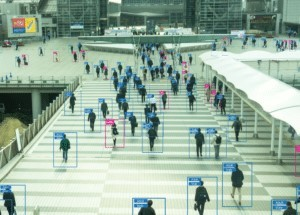

# Deep-learning-Object-detection-using-Tensorflow-API
## Abstract
Efficient and accurate object detection has been an important topic in the advancement of computer vision systems. With the advent of deep learning techniques, the accuracy for object detection has increased drastically. The project aims to incorporate state-ofthe-art technique for object detection with the goal of achieving high accuracy with a real-time performance. A major challenge in many of the object detection systems is the dependency on other computer vision techniques for helping the deep learning based approach, which leads to slow and non-optimal performance. In this project, we use a completely deep learning based approach to solve the problem of object detection in an end-to-end fashion. The network is trained on the most challenging publicly available dataset (Microsoft COCO), on which a object detection challenge is conducted annually. The resulting system is fast and accurate, thus aiding those applications which require object detection.

The TensorFlow Models GitHub repository has a large variety of pre-trained models for various machine learning tasks, and one excellent resource is their object detection API. The object detection API helps us to train our own object detection model for a large variety of different applications. Whether you need a high-speed model to work on live stream high-frames-per-second (fps) applications or high-accuracy desktop models, the API helps us to train and export a model. Here we have used a pre-trained COCO dataset model named ’Faster R-CNN inception v2 COCO’ available in the GitHub repository and performed a fine tuning (retraining) of the model with our own dataset(RGUKT student ID cards) to perform real time object detection when the input is couple of images, video and a live webcam stream.
## 1.1 Problem statement
Many problems in computer vision were saturating on their accuracy before a decade. However, with the rise of deep learning techniques, the accuracy of these problems drastically improved. One of the major problem was that of image classification, which is defined as predicting the class of the image. A slightly complicated problem is that of image localization, where the image contains a single object and the system should predict the class of the location of the object in the image (a bounding box around the object). The more complicated problem (this project), of object detection involves both classification and localization. In this case, the input to the system be an image, video or live webcam stream, the output will be a bounding box corresponding to all the objects in the input, along with the class of object in each box.
## 1.2 Object detection
Object Detection is the process of finding real-world object instances like car, bike, TV, flowers, and humans in still images or Videos. It allows for the recognition, localization, and detection of multiple objects within an image which provides us with a much better understanding of an image as a whole. It is commonly used in applications such as image retrieval, security, surveillance, and advanced driver assistance systems (ADAS).
## 1.3 Tensorflow framework
Tensorflow is Google’s Open Source Machine Learning Framework for dataflow programming across a range of tasks. Nodes in the graph represent mathematical operations, while the graph edges represent the multi-dimensional data arrays (tensors) communicated between them.

  

Tensors are just multidimensional arrays, an extension of 2-dimensional tables to data with a higher dimension. There are many features of Tensorflow which makes it appropriate for Deep Learning.

## 1.4 Object detection workflow

Object detection workflow has the following steps :

1.Preparation of dataset.

2.Annotating the dataset.

3.Training the model on dataset and performing evaluation.

4.Testing the model on new unseen data.

  
                                     
                                       FIGURE 1.2:  Object detection workflow
  
  ## 1.5 Applications of Object detection
  ### 1.5.1 Facial recognition
  A deep learning facial recognition system called the “DeepFace” has been developed by a group of researchers in the Facebook, which identifies human faces in a digital image very effectively. Google uses its own facial recognition system in Google Photos, which automatically segregates all the photos based on the person in the image. There are various components involved in Facial Recognition like the eyes, nose, mouth and the eyebrows.
  

  
  
                                             FIGURE 1.3:  Facial recognition
 
  ### 1.5.2 People counting
  Object detection can be also used for people counting, it is used for analyzing store performance or crowd statistics during festivals. These tend to be more difficult as people move out of the frame quickly.
It is a very important application, as during crowd gathering this feature can be used for multiple purposes.
  

  
  
                                             FIGURE 1.4: People Counting

  ### 1.5.3 Industrial quality check
   Object detection is also used in industrial processes to identify products. Finding a specific object through visual inspection is a basic task that is involved in multiple industrial processes like sorting, inventory management, machining, quality management, packaging etc.
Inventory management can be very tricky as items are hard to track in real time. Automatic object counting and localization allows improving inventory accuracy.
  

  
  
                                            FIGURE 1.5: Industrial quality check
                                            
  ### 1.5.4 Self driving car
  Self-driving cars are the Future, there’s no doubt in that. But the working behind it is very tricky as it combines a variety of techniques to perceive their surroundings, including radar, laser light, GPS, odometry, and computer vision.
  Advanced control systems interpret sensory information to identify appropriate navigation paths, as well as obstacles and once the image sensor detects any sign of a living being in its path, it automatically stops. This happens at a very fast rate and is a big step towards Driverless Cars.
  

  
  
  ### 1.5.5 Security
  Object Detection plays a very important role in Security. Be it face ID of Apple or the retina scan used in all the sci-fi movies.
It is also used by the government to access the security feed and match it with their existing database to find any criminals or to detect the robbers’ vehicle.
The applications are limitless.

## 2. Faster Region-based Convolutional Network (Faster RCNN)
Region proposals detected with the selective search method were still necessary in the previous model, which is computationally expensive. S. Ren and al. (2016) have introduced Region Proposal Network (RPN) to directly generate region proposals, predict bounding boxes and detect objects. The Faster Region-based Convolutional Network (Faster RCNN) is a combination between the RPN and the Fast R-CNN model.

A CNN model takes as input the entire image and produces feature maps. A window of size 3x3 slides all the feature maps and outputs a features vector linked to two fullyconnected layers, one for box-regression and one for box-classification. Multiple region proposals are predicted by the fully-connected layers. A maximum of k regions is fixed thus the output of the box-regression layer has a size of 4k (coordinates of the boxes, their height and width) and the output of the box-classification layer a size of 2k (“objectness” scores to detect an object or not in the box). The k region proposals detected by the sliding window are called anchors.

  
                                 
                                 FIGURE 2.1: Faster Region-based Convolutional Network
 
When the anchor boxes are detected, they are selected by applying a threshold over the “objectness” score to keep only the relevant boxes. These anchor boxes and the feature maps computed by the initial CNN model feeds a Fast R-CNN model.

Faster R-CNN uses RPN to avoid the selective search method, it accelerates the training and testing processes, and improve the performances. The RPN uses a pre-trained model over the ImageNet dataset for classification and it is fine-tuned on the PASCAL VOC dataset. Then the generated region proposals with anchor boxes are used to train the Fast R-CNN. This process is iterative.

The best Faster R-CNNs have obtained mAP scores of 78.8% over the 2007 PASCAL VOC test dataset and 75.9% over the 2012 PASCAL VOC test dataset. They have been trained with PASCAL VOC and COCO datasets. One of these models is 34 times faster than the Fast R-CNN using the selective search method.

## 3. Building the Object detection classifier
  ### 3.1 Installation of required software
  The system should have anaconda software version 3.0. We have been using windows 8.0 OS and we have installed anaconda 3-5.2.0 x64 bit. Python version v3.7.1 should also be installed. One can install the python package using the following command in Anaconda prompt.   "conda install -c anaconda python".
  ### 3.1.1 Dependencies
  Tensorflow Object Detection API depends on the following libraries:
•	Tensorflow
•	Numpy
•	Matplotlib
•	Pillow 1.0
•	lxml
•	tf Slim
•	Protobuf 3.0.0.

A typical user can install Tensorflow using following command, Installing tensorflow will install all the above mentioned libraries Protobuf, pillow, lxml, tfslim, Numpy and Matplotlib. As our system does not has any GPU such as Nvidia, Radeon etc., we will go with Tensorflow CPU version intsallation by issuing the follwing command in Anaconda prompt.
Command for installing Tensorflow CPU version:

"pip install tensorflow"

The above installations are needed for image detection using Tensorflow API.
For object detection in a live webcam stream using Tensorflow API, we need an extra module called openCV version 3.0. OpenCV module allows us to initialize a camera object and to read the frame from the live webcam stream so that we can detect objects. One can install openCV using Anaconda prompt using the following command 

"conda install -c conda-forge opencv"
  ### 3.1.2 Set up TensorFlow Directory and Anaconda Virtual Environment
  The TensorFlow Object Detection API requires using the specific directory structure provided in its GitHub repository. It also requires several additional Python packages, specific additions to the PATH and PYTHONPATH variables, and a few extra setup commands to get everything set up to run or train an object detection model.
  ### 3.1.3 Download the Faster-RCNN-Inception-V2-COCO model from TensorFlow’s model zoo
  TensorFlow provides several object detection models (pre-trained classifiers with specific neural network architectures) in its model zoo. Some models (such as the SSD-MobileNet model) have an architecture that allows for faster detection but with less accuracy, while some models (such as the Faster-RCNN model) give slower detection but with more accuracy. We initially started with the SSD-MobileNet-V1 model, but it did not do a very good job identifying the ID cards in my images. We re-trained our detector on the FasterRCNN-Inception-V2 model, and the detection worked considerably better, but with a noticeably slower speed.
  
You can choose which model to train your objection detection classifier on. If you are planning on using the object detector on a device with low computational power (such as a smart phone or Raspberry Pi), use the SDD-MobileNet model. If you will be running your detector on a decently powered laptop or desktop PC, use one of the RCNN models.

Here we will use the Faster-RCNN-Inception-V2 model. Download the model here. Open the downloaded faster rcnn inception v2 coco 2018 01 28.tar.gz file with a file archiver such as WinZip and extract the faster rcnn inception v2 coco 2018 01 28 folder to the C drive/tensorflow1/models/research/object detection folder.
### 3.1.4 Set up new Anaconda virtual environment
Next, we will work on setting up a virtual environment in Anaconda for tensorflow-cpu. From the Start menu in Windows, search for the Anaconda Prompt utility and run it.
In the command terminal that pops up, create a new virtual environment called “tensorflow1” by issuing the following command :
 
C:\> conda create -n tensorflow1 pip python=3.5
 
Then, activate the environment by issuing :
 
C:\> conda activate tensorflow1
 
Install tensorflow-cpu in this environment by issuing :
 
(tensorflow1) C:\> pip install tensorflow
 
Install the other necessary packages by issuing the following commands :

(tensorflow1) C:\> conda install -c anaconda protobuf, 
(tensorflow1) C:\> pip install pillow, 
(tensorflow1) C:\> pip install lxml, 
(tensorflow1) C:\> pip install Cython, 
(tensorflow1) C:\> pip install jupyter, 
(tensorflow1) C:\> pip install matplotlib, 
(tensorflow1) C:\> pip install pandas, 
(tensorflow1) C:\> pip install opencv-python.

### 3.1.5 Configure PYTHONPATH environment variable
A PYTHONPATH variable must be created that points to the /models, /models/research, and /models/research/slim directories. Do this by issuing the following commands :
 
(tensorflow1) C:\> set PYTHONPATH=C:\tensorflow1\models;C:\tensorflow1\models\research; C:\tensorflow1\models\research\slim
 
(Note: Every time the ”tensorflow1” virtual environment is exited, the PYTHONPATH variable is reset and needs to be set up again.)
### 3.1.6 Compile Protobufs and run setup.py
Next, compile the Protobuf files, which are used by TensorFlow to configure model and training parameters. Unfortunately, the short protoc compilation command posted on TensorFlow’s Object Detection API installation page does not work on Windows. Every .proto file in the /object detection/protos directory must be called out individually by the command.

In the Anaconda Command Prompt, change directories to the /models/research directory and copy and paste the following command into the command line and press Enter :

 
protoc --python_out=. .\object_detection\protos\anchor_generator.proto .
\object_detection\protos\argmax_matcher.proto .\object_detection\protos \bipartite_matcher.proto .\object_detection\protos\box_coder.proto .
\object_detection\protos\box_predictor.proto .\object_detection\protos
\eval.proto .\object_detection\protos\faster_rcnn.proto .\object_detection
\protos\faster_rcnn_box_coder.proto .\object_detection\protos
\grid_anchor_generator.proto .\object_detection\protos\hyperparams.proto . \object_detection\protos\image_resizer.proto .\object_detection\protos \input_reader.proto .\object_detection\protos\losses.proto .\object_detection \protos\matcher.proto .\object_detection\protos\mean_stddev_box_coder.proto .
\object_detection\protos\model.proto .\object_detection\protos\optimizer.proto .
\object_detection\protos\pipeline.proto .\object_detection\protos
\post_processing.proto .\object_detection\protos\preprocessor.proto . \object_detection\protos\region_similarity_calculator.proto .\object_detection \protos\square_box_coder.proto .\object_detection\protos\ssd.proto .
\object_detection\protos\ssd_anchor_generator.proto .\object_detection
\protos\string_int_label_map.proto .\object_detection\protos\train.proto .
\object_detection\protos\keypoint_box_coder.proto .\object_detection\protos
\multiscale_anchor_generator.proto .\object_detection\protos\graph_rewriter.proto
 
This creates a name pb2.py file from every name.proto file in the /object detection/protos folder.
(Note: TensorFlow occassionally adds new .proto files to the /protos folder. If you get an error saying ImportError: cannot import name ’something something pb2’ , you may need to update the protoc command to include the new .proto files.)
Finally, run the following commands from the C:/tensorflow1/models/research directory one after the other:
 
(tensorflow1) C:\tensorflow1\models\research> python setup.py build

(tensorflow1) C:\tensorflow1\models\research> python setup.py install

## 4. Data set preparation
Now that the TensorFlow Object Detection API is all set up and ready to go, we need to provide the images it will use to train a new detection classifier.
  ### 4.1 Gather Pictures
  TensorFlow needs hundreds of images of an object to train a good detection classifier. To train a robust classifier, the training images should have random objects in the image along with the desired objects, and should have a variety of backgrounds and lighting conditions. There should be some images where the desired object is partially obscured, overlapped with something else, or only halfway in the picture.
  
  For our RGUKT student ID card detector, we have three different objects we want to detect (the ID label Manikanta, Saikumar and Pradeep). We used our SONY digital camera to take about 476 pictures of cards on its own, with various other non-desired objects and multiple cards in the picture. We know we want to be able to detect the cards when they are overlapping, so we made sure to have the cards be overlapped in many images.
 

  
  
                                        FIGURE : 4.1.1 IIIT student ID card Dataset

Make sure the images are not too large. They should be less than 300KB each, and their resolution should not be more than 720x1280. The larger the images are, the longer it will take to train the classifier. After we have all the pictures we need, we have moved 20% of them to the /object detection/images/test directory, and 80% of them to the /object detection /images/train directory. We made sure that there are a variety of pictures in both the /test and /train directories.
